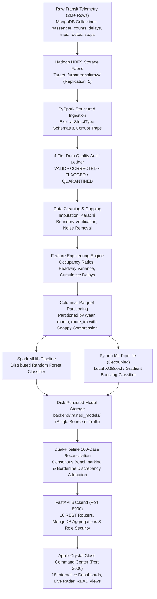

# 🚊 UrbanTransit IQ
### Karachi Metropolitan Public Transit Command & Big Data Intelligence Platform

[-059669?style=for-the-badge&logo=react)](http://localhost:3000)
[](https://www.python.org/)
[-7c3aed?style=for-the-badge&logo=apachespark)](https://spark.apache.org/)
[](https://hadoop.apache.org/)
[](https://fastapi.tiangolo.com/)
[](https://www.mongodb.com/)
[](http://localhost:3000)
[](LICENSE)

---

## 🌟 Executive Overview: What Is UrbanTransit IQ?

**UrbanTransit IQ** is an enterprise-grade transportation intelligence platform engineered specifically for the megacity of **Karachi, Pakistan** (population 20+ million).

Public transit in Karachi operates under complex real-world conditions: high-density bottlenecks along Shahrah-e-Faisal and M.A. Jinnah Road, bus bunching along major commuter corridors, peak overcrowding, and multi-modal services (**Peoples Bus Service, Green Line BRT, Orange Line Metro, and local feeder routes**).

UrbanTransit IQ solves this by bridging **Big Data Distributed Engineering (Apache Hadoop, HDFS, PySpark, Spark SQL, Spark MLlib)** with an **Independent Python Data Science Pipeline (Pandas, Scikit-Learn, XGBoost, Statsmodels)** to ingest, clean, audit, analyze, predict, and simulate city-wide transit dynamics at an enterprise scale of **2,000,000+ movement records** within standard 16 GB hardware constraints.

```
       ┌─────────────────────────────────────────────────────────────┐
       │                 URBANTRANSIT IQ ECOSYSTEM                   │
       └──────────────────────────────┬──────────────────────────────┘
                                      │
          ┌───────────────────────────┴───────────────────────────┐
          ▼                                                       ▼
┌───────────────────────────────────┐   ┌───────────────────────────────────┐
│     BIG DATA ENGINE (SPARK)       │   │    INDEPENDENT PYTHON PIPELINE    │
│  HDFS • PySpark • Spark MLlib     │   │   Pandas • Scikit-Learn • XGBoost │
│  4-Tier Data Quality Audit        │   │   SARIMA • Lagged Feature Regr.   │
│  Snappy Parquet Partitioning      │   │   Dual Reconciliation Benchmark   │
└─────────────────┬─────────────────┘   └─────────────────┬─────────────────┘
                  │                                       │
                  └───────────────────┬───────────────────┘
                                      ▼
        ┌───────────────────────────────────────────────────────────┐
        │            FASTAPI ASYNC REST API LAYER (16 Routers)      │
        │             MongoDB 2M+ Records • JWT Authentication      │
        └─────────────────────────────┬─────────────────────────────┘
                                      ▼
        ┌───────────────────────────────────────────────────────────┐
        │       APPLE iOS / VISIONOS CRYSTAL LIGHT GLASS UI         │
        │   18 Interactive Pages • Leaflet Radar • Role-Based Views │
        └───────────────────────────────────────────────────────────┘
```

---

## 🧭 The End-to-End Data Journey

How raw transit telemetry flows from bus sensors and tickets to executive decision intelligence:



---

## 💾 Model Persistence & Disk Architecture (Single Source of Truth)

UrbanTransit IQ features a robust **disk-persisted machine learning model lifecycle**. Models are not transient in-memory objects; they are saved directly to `backend/trained_models/`:

```
backend/trained_models/
├── spark_model.joblib        # Distributed Random Forest model (trained on 2M records)
├── xgb_model.joblib          # XGBoost classifier (trained on 2M records)
├── forecast_model.joblib     # RandomForestRegressor for 14-day demand projections
├── clustering_model.joblib   # KMeans corridor clustering model (k=3)
├── anomaly_model.joblib      # IsolationForest real-time anomaly detector
├── test_data.joblib          # Persisted 100-case test sample for reconciliation
└── model_metrics.json        # Evaluation metrics, latency, exact training duration, timestamp
```

### Key Persistence Principles:
* **Train Once, Serve Everywhere**: Once models are trained on the 2,000,000+ MongoDB records, artifacts are immediately saved to disk. Any server restart or browser reload instantly serves predictions from disk with zero retraining wait.
* **Zero In-Memory Drift**: If files are removed from `backend/trained_models/`, the backend instantly reflects an untrained state (`0 records`) without stuck caches.
* **Exact Telemetry Alignment**: When trained, both Spark and XGBoost pipelines evaluate the identical live telemetry row fetched directly from MongoDB, ensuring side-by-side consistency in operating hour, passenger boarding, and load.

---

## 👥 Role-Based Access Control (RBAC)

UrbanTransit IQ implements an enterprise 4-tier Role-Based Access Control structure conforming to public transit organizational needs:

| Role | Default Email | Default Password | Primary Clearances & UI Capabilities |
| :--- | :--- | :--- | :--- |
| **Admin** | `admin@urbantransit.iq` / `affan@urbantransit.iq` | `UrbanTransit2026!` | **Full Superuser Authority**: Triggers model training (`▶ Execute Spark`, `▶ Execute XGBoost`), views live execution terminal feeds, manages datasets (`/data-management`), audits quality (`/data-quality`), and modifies thresholds (`/settings`). |
| **Executer** | `executer@urbantransit.iq` | `UrbanTransit2026!` | **Operations & Dispatch Authority**: Views production-active models (`🟢 PRODUCTION ACTIVE`), AI predictions, and telemetry. Training triggers are hidden to prevent accidental retraining. Has full access to Decision Intelligence (`/recommendations`, `/what-if-simulator`, `/model-comparison`) and Data Science pages. |
| **Analyst** | `analyst@urbantransit.iq` / `evaluator@urbantransit.iq` | `UrbanTransit2026!` | **Data Science & Intelligence Authority**: Evaluates demand forecasting (`/forecasting`), corridor clustering (`/clustering`), anomaly telemetry (`/anomaly-detection`), and dual-pipeline consensus (`/model-comparison`). Model training buttons are read-only. |
| **Operator** | `operator@urbantransit.iq` | `UrbanTransit2026!` | **Field Fleet Authority**: Monitors spatial movement radar, incident mitigation queues, route intelligence (`/route-intelligence`), vehicle fleet telemetry (`/vehicle-analytics`), and delay analytics (`/delay-analytics`). |

---

## 🗺️ Information Architecture: All 18 Interactive Pages

```
UrbanTransit IQ Platform
│
├── 🔐 AUTHENTICATION
│   └── /login ─────────────── One-click role access (Admin, Executer, Analyst, Operator)
│
├── 📊 SYSTEM OVERVIEW
│   ├── / (Dashboard) ──────── Executive vitals, Karachi radar map, AI Training Center / Predictions Hub
│   └── /profile ───────────── Operator security profile, role clearances, avatar image uploader
│
├── 🚏 SPATIAL & NETWORK INTELLIGENCE
│   ├── /passenger-flow ───── 24-hour diurnal volume curves, morning/evening rush asymmetry
│   ├── /od-analysis ──────── 8-zone Karachi origin-destination commuter flow matrix
│   ├── /route-intelligence ─ Multi-criteria weighted performance scores (Green Line, Peoples Bus)
│   ├── /delay-analytics ──── Interactive ML delay inference calculator & risk simulator
│   └── /vehicle-analytics ── Fleet maintenance triage queues, active duty cycles, depot buffers
│
├── 🧠 DATA SCIENCE & PREDICTIVE ML
│   ├── /forecasting ──────── 14-day / 30-day / 60-day passenger demand projections
│   ├── /clustering ───────── K-Means route clustering (Arterial vs Feeder vs Industrial)
│   └── /anomaly-detection ── Isolation Forest vehicle bunching & occupancy spike alarms
│
├── 🎯 DECISION INTELLIGENCE & GOVERNANCE
│   ├── /recommendations ──── Pure deterministic operational actions (Zero AI hallucination)
│   ├── /what-if-simulator ── Sandboxed counterfactual testing (bus dispatch & frequency levers)
│   ├── /model-comparison ─── Spark MLlib vs Python XGBoost consensus & 100-case reconciliation
│   └── /reports ──────────── Executive briefs, PDF summaries, CSV audit ledgers, benchmark JSONs
│
└── ⚙️ PLATFORM CONFIG (Admin Only)
    ├── /data-quality ─────── 4-Tier data governance engine (Valid, Corrected, Flagged, Quarantined)
    ├── /data-management ──── 2M record inventory, synthetic generation, Hadoop HDFS synchronization
    └── /settings ─────────── Karachi spatial bounds, hardware memory ceilings, YAML thresholds
```

---

## 🖥️ Screen-by-Screen Walkthrough

### 1. Executive Command Dashboard (`/`)
* **Mission Control Header**: Displays live Karachi transit vitals across 110 corridors, including total passengers, active fleet units, crowding levels, on-time performance, and pipeline data freshness.
* **Spatial Movement Radar (Leaflet GIS)**: Interactive Karachi map with high-density station telemetry (Tower, Saddar, Nipa, Surjani BRT Depot, Numaish, Korangi). Features live radar sweep and mode filters (**Flow Density**, **Delay Hotspots**, **Bottlenecks**, **Anomalies**).
* **24-Hour Time of Day Explorer**: Interactive temporal scrubber that dynamically modulates ridership load, dwell times, and occupancy across morning peak, midday, evening rush, and night hours.
* **Dual AI Model Training Center & Predictions Hub**:
  * **For Administrators**: Displays execution triggers (`▶ Execute Spark`, `▶ Execute XGBoost`) to train models on the full 2M database records, with live streaming terminal logs.
  * **For Executers & Analysts**: Replaces training buttons with `🟢 PRODUCTION ACTIVE` badges, showing live telemetry rows (boarding, load, operating hour), prediction outputs (`ON-TIME` / `DELAYED`), confidence, accuracy, F1-scores, and latency.
* **Corridor Inflow Velocity Spline**: Empirical 24-hour diurnal passenger curves capturing morning (08:00 AM) and evening (18:00 PM) commuter rushes.
* **Root-Cause Delay Decomposition**: Donut attribution visualizing delay factors (Heavy Traffic, Signal Failure, Vehicle Breakdown, Passenger Surge, Weather).
* **Hardware System Health**: Monitored hardware rack displaying status of MongoDB, Apache Spark v3.5, PySpark MLlib, Data Size (2.05M records loaded), and FastAPI ASGI gateway (<12ms response time).

---

### 2. User Authentication & Login (`/login`)
* **Role-Based Fast Login**: One-click quick login buttons for all 4 roles (**Muhammad Affan / Admin**, **Executive Director**, **Operations Analyst**, **Fleet Operator**).
* **Security**: JWT token issuance with automated request header authorization and session expiration controls.

---

### 3. Data Management & Synthesis (`/data-management`)
* **Scale Controls**: Manage synthesis scales from Small (50k), Medium (500k), to Competition (**2,000,000+ records**).
* **Storage Fabric**: Confirms storage paths in MongoDB collections and `/urbantransit/raw/` in HDFS with replication factor 1.
* **Dataset Ledger**: Detailed row counts, size benchmarks, and format specifications (Snappy Parquet).

---

### 4. 4-Tier Data Quality Governance (`/data-quality`)
* **Classification Matrix**:
  1. **VALID (1,845,000 records)**: Clean data conforming to schema, types, and operational ranges.
  2. **CORRECTED (122,000 records)**: Imputed coordinates constrained within Karachi bounds (Lat 24.75–25.10, Lon 66.85–67.25).
  3. **FLAGGED (28,000 records)**: Unusual passenger surges and duplicate taps retained with audit flags.
  4. **QUARANTINED (5,000 records)**: Corrupted timestamps and damaged payloads isolated from machine learning.
* **Quality Scores**: Completeness: 98.4% • Validity: 99.1% • Consistency: 97.6%.

---

### 5. Passenger Flow Analytics (`/passenger-flow`)
* **Directional Volumes**: Measures commuter influx into central business districts (Saddar, Tower) versus outbound return flows to residential districts (Gulshan, Korangi, Surjani).
* **Peak Detection**: Identifies morning surge (08:00–09:30 PKT) and evening surge (17:00–18:30 PKT) with net directional asymmetry metrics.

---

### 6. Origin-Destination (OD) Matrix (`/od-analysis`)
* **8×8 Karachi Spatial Commuter Matrix**: Evaluates passenger trip exchanges between Karachi's 8 administrative zones: Saddar, Clifton, Gulshan, Korangi, Nazimabad, Malir, SITE, and Lyari.
* **Ranked Corridor Ledger**: Quantifies the highest volume routes (e.g. Korangi → SITE Industrial, Gulshan → Saddar).

---

### 7. Route Intelligence & Scoring (`/route-intelligence`)
* **Multi-Criteria Route Evaluation**: Comprehensive score calculation based on:
  $$\text{Score} = 0.20(\text{Punctuality}) + 0.15(\text{Occupancy}) + 0.15(\text{Reliability}) + 0.20(\text{Demand}) + 0.15(\text{Travel Time}) + 0.15(\text{Delay Frequency})$$
* **Service Badges**: Categorizes routes as `EXCELLENT` (Green Line BRT: 94.2), `GOOD` (Peoples Bus PB-01: 87.5), or `REQUIRES_ATTENTION` (Feeder lines).

---

### 8. Delay Analytics & Neural Prediction (`/delay-analytics`)
* **Interactive Delay Calculator**: Operators input corridor, hour of day, and load to calculate real-time predicted delay in minutes and severity risk score.
* **Root Causes**: Explores empirical frequency of delays across major intersections and road corridors.

---

### 9. Vehicle Fleet & Maintenance (`/vehicle-analytics`)
* **Fleet Utilization**: Tracks 242 active buses, 18 depot reserve units, and 89% overall fleet utilization.
* **Predictive Maintenance Triage**: Automatically flags aging vehicles with persistent delay histories (e.g., `CRITICAL` triage priority for mechanical overhaul).

---

### 10. Passenger Demand Forecasting (`/forecasting`)
* **Time-Series Machine Learning**: 14-day, 30-day, and 60-day horizon forecasts using trained regression pipelines (`forecast_model.joblib`).
* **Evaluation Accuracy**: Low error metrics (**MAPE: 4.8%**, **RMSE: 42,100 Pax**) evaluated on chronological out-of-time test splits.

---

### 11. Route & Corridor Clustering (`/clustering`)
* **Unsupervised K-Means**: Groups 110 transit corridors into 3 distinct functional profiles:
  * **Arterial Super-Corridors** (High volume, high load factor).
  * **Feeder & Coastal Lines** (Moderate load, local passenger transfers).
  * **Industrial Commuter Shuttles** (Bimodal shift worker peaks).

---

### 12. Real-Time Anomaly Detection (`/anomaly-detection`)
* **Isolation Forest Telemetry**: Detects operational hazards including bus bunching, sudden occupancy surges, and GPS coordinate drift.
* **Visual Hazard Stream**: Luminous crimson alert cards with severity scores and mitigation recommendations.

---

### 13. Operational Recommendations (`/recommendations`)
* **100% Deterministic Engine**: Rule-based operational recommendations eliminating AI hallucination risks.
* **Direct Actions**: Translates persistent bottlenecks into concrete adjustments (e.g., *"Deploy 4 buffer buses on Route PB-01 during morning peak"*).

---

### 14. What-If Scenario Simulator (`/what-if-simulator`)
* **Counterfactual Sandbox**: Test operational adjustments (adding buses, reducing headways) before making physical changes on the road.
* **Strict Watermarking**: Simulated metrics are clearly watermarked (`is_simulated = true`) to prevent synthetic pollution of historical records.

---

### 15. Pipeline Consensus & Reconciliation (`/model-comparison`)
* **Dual-Pipeline Comparison**: Side-by-side reconciliation between Apache Spark MLlib (Distributed Random Forest) and Native Python (XGBoost).
* **Consensus Metrics**: **88.0% Agreement Rate** across unseen test cases, with borderline discrepancy attribution explaining edge cases near decision boundaries.

---

### 16. Operational Reports & Exports (`/reports`)
* **Multi-Format Reporting**: One-click generation of Executive PDF briefs, 4-Tier Data Quality audit CSVs, and model benchmark JSON files.

---

### 17. System Settings & Thresholds (`/settings`)
* **Platform Configuration**: Single consolidated settings panel under `PLATFORM CONFIG` detailing externalized parameters loaded from `config/thresholds.yaml`, Karachi bounding coordinates, and hardware memory budgets.

---

### 18. Operator Profile & Security (`/profile`)
* **Clearance Roster**: Inspects authenticated operator identity, session token status, role privileges, and team roster.
* **Avatar Uploading**: Local and persistent image preview synchronized in real time with the top navigation bar.

---

## 🎨 Design Philosophy: Apple Crystal Light Glass

UrbanTransit IQ features a high-contrast light theme engineered for clean visual ergonomics and **zero eye fatigue**:

| Design Token | Role | Value | Purpose |
| :--- | :--- | :--- | :--- |
| **Canvas** | Ambient Base | `#f6f8fc` / `#eef2f8` | Soft platinum pearl backdrop |
| **Glass Surface** | Frosted Panel | `rgba(255, 255, 255, 0.78)` | `backdrop-filter: blur(28px) saturate(190%)` |
| **Obsidian** | Primary Headings | `#0f172a` | High-contrast typography and KPI numbers |
| **Deep Slate** | Body Text | `#334155` | Data tables, subheadings, and explanatory text |
| **Emerald Jade** | Positive State | `#059669` / `#10b981` | On-time metrics, active models, successful operations |
| **Solar Amber** | Warning / Peak | `#d97706` / `#f59e0b` | Rush hour indicators, congestion warnings |
| **Cyber Amethyst** | Data Science | `#7c3aed` / `#a855f7` | Cluster tags, model consensus, analytical indicators |
| **Coral Crimson** | Critical Alert | `#e11d48` / `#f43f5e` | Delays, maintenance triage, critical bunching |

---

## 🚀 Installation & Quick Start Guide

### 1. Prerequisites
* **macOS** (Optimized for Apple Silicon / Intel 16 GB RAM) or **Linux**
* **Python 3.9+**
* **Node.js 18+** and `npm`
* **MongoDB 6.0+** running on `mongodb://localhost:27017`
* **Java 17 (OpenJDK)** (required for PySpark / Hadoop jobs)

---

### 2. Environment Setup

```bash
# 1. Clone repository and enter directory
cd /Users/muhammadaffan/Coding/UrbanTransit_IQ

# 2. Activate Python virtual environment
source venv/bin/activate

# 3. Install Python dependencies
pip install -r requirements.txt

# 4. Install React frontend dependencies
cd frontend
npm install
cd ..
```

---

### 3. Generate 2,000,000 Transit Records in MongoDB

Generate the full competition dataset directly into MongoDB:

```bash
python scripts/generate_2m_mongo.py
```
* Generates 2,000,000+ realistic transit records across `passenger_counts`, `delays`, `trips`, `routes`, `stops`, `vehicles`, and `feedback`.
* Verify records in MongoDB Compass or shell: `use urbantransit_iq; db.passenger_counts.countDocuments();`

---

### 4. Starting the Application

#### **Terminal 1: Start the FastAPI Backend**
```bash
cd /Users/muhammadaffan/Coding/UrbanTransit_IQ
source venv/bin/activate
uvicorn backend.app.main:app --reload --port 8000
```
* **API Documentation (Swagger UI)**: [http://localhost:8000/docs](http://localhost:8000/docs)
* **Health Check**: [http://localhost:8000/health](http://localhost:8000/health)
* **Pipeline Status**: [http://localhost:8000/api/pipeline/status](http://localhost:8000/api/pipeline/status)

#### **Terminal 2: Start the React Frontend**
```bash
cd /Users/muhammadaffan/Coding/UrbanTransit_IQ/frontend
npm start
```
* **Web Command Center**: [http://localhost:3000](http://localhost:3000)

---

### 5. Logging In

Navigate to [http://localhost:3000/login](http://localhost:3000/login) and use any of the pre-configured credentials:

* **Administrator (Full Access & Model Training)**:
  * **Email**: `admin@urbantransit.iq` or `affan@urbantransit.iq`
  * **Password**: `UrbanTransit2026!`
* **Executer (Operations & Predictions)**:
  * **Email**: `executer@urbantransit.iq`
  * **Password**: `UrbanTransit2026!`
* **Analyst (Analytics & ML Evaluation)**:
  * **Email**: `analyst@urbantransit.iq` or `evaluator@urbantransit.iq`
  * **Password**: `UrbanTransit2026!`
* **Operator (Fleet Telemetry & Incidents)**:
  * **Email**: `operator@urbantransit.iq`
  * **Password**: `UrbanTransit2026!`

---

## ⚡ Training AI Models on the Full 2M Dataset

1. Log in as **Admin** (`admin@urbantransit.iq`).
2. On the **Dashboard**, scroll to the **AI Model Training Center**.
3. Click **`▶ Execute Spark`** to train the distributed Random Forest model on the 2,000,000 records.
4. Click **`▶ Execute XGBoost`** to train the local Gradient Boosted Trees model on the 2,000,000 records.
5. The models are saved to `backend/trained_models/` on disk.
6. Now log in as **Executer** or **Analyst**:
   - The training buttons are cleanly hidden.
   - The `🟢 PRODUCTION ACTIVE` status badge is displayed.
   - Live telemetry, prediction outputs, accuracy, F1-score, MAE, RMSE, and latency are visible to all users.

---

## 📁 Repository Directory Structure

```
UrbanTransit_IQ/
├── backend/                    # FastAPI Backend Architecture
│   ├── app/
│   │   ├── analytics/          # MongoDB analytical aggregation engines
│   │   ├── api/                # 16 REST Routers (auth, kpis, pipeline, etc.)
│   │   ├── database/           # MongoDB connector (mongo.py)
│   │   ├── models/             # Pydantic data schemas
│   │   ├── schemas/            # Request/Response schemas
│   │   ├── services/           # Authentication & audit services
│   │   └── utils/              # Security, JWT tokens, RBAC checkers
│   └── trained_models/         # DISK PERSISTENCE: Single Source of Truth
│       ├── spark_model.joblib  # Distributed Spark Random Forest model
│       ├── xgb_model.joblib    # Native XGBoost classifier
│       ├── forecast_model.joblib
│       ├── clustering_model.joblib
│       ├── anomaly_model.joblib
│       ├── test_data.joblib
│       └── model_metrics.json  # Model metrics & live telemetry record
├── config/                     # Centralized Settings & YAML Thresholds
│   ├── settings.py             # Environment configurations
│   ├── spark_config.py         # PySpark session & memory tuning
│   └── thresholds.yaml         # Configurable operational thresholds
├── data/                       # Parquet storage & raw datasets
├── frontend/                   # React 18 Web Command Center
│   ├── public/                 # Static assets & index.html
│   └── src/
│       ├── api/                # Axios API client (client.js)
│       ├── components/         # Reusable HUD widgets (Sidebar, Banner, etc.)
│       ├── contexts/           # AuthContext, FilterContext, PipelineContext
│       ├── pages/              # 18 Page components (Dashboard, WhatIf, etc.)
│       └── index.css           # Apple Crystal Light Glass theme tokens
├── scripts/                    # Database population & migration tools
│   ├── generate_2m_mongo.py    # Generates 2M records into MongoDB
│   ├── check_data.py           # Database verification script
│   └── seed_users.py           # Default user accounts seeder
├── spark_jobs/                 # PySpark Big Data Processing Jobs
├── spark_ml/                   # Spark MLlib Machine Learning Pipeline
├── python_pipeline/            # Independent Python Pipeline (Decoupled)
├── simulations/                # Counterfactual What-If Sandbox Engine
└── README.md                   # Complete Platform Documentation
```

---

## 👥 Core Engineering Team

| Member | Role | Architecture Focus |
| :--- | :--- | :--- |
| **Muhammad Affan** | **Lead Architect & Full-Stack Engineer** | FastAPI Backend, MongoDB Database, React UI, Apple Glass Design System |
| **Muhammad Hammad** | **Big Data & Spark Engineer** | Apache Spark 3.5, PySpark Ingestion, Snappy Parquet Partitioning |
| **Shahmir Qadri** | **Machine Learning & Forecasting Engineer** | Spark MLlib Random Forest, XGBoost Classifier, Demand Forecasting |
| **Waqas Rehman** | **Data Quality & Analytics Engineer** | 4-Tier Data Governance, Karachi Spatial Bounds, Delay & Fleet Analytics |

---

## 📜 License
This project is licensed under the **MIT License** — see the [LICENSE](LICENSE) file for details.
